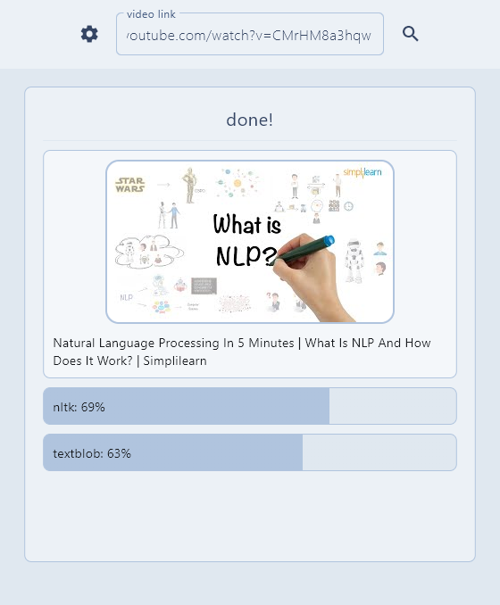

# Analisador de sentimentos de Comentarios do Youtube

Programa escrito em Python que possui as seguintes funcionalidades:

- extrair uma amostra de comentarios, com Selenium
- traduzir a amostra para ingles, com Google Gemini
- analisar a amostra, com NLTK e TextBlob
- ilustrar os processos em uma interface grafica, com Flet

---

